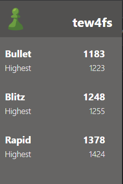

# Chess.com Google Chrome Extension
This extension displays the current and best Chess.com ratings for user in the time controls of bullet, blitz, and rapid. The extension utilizes the [published Chess.com API](https://www.chess.com/news/view/published-data-api). It also follows a similar structure as the [Chrome extension tutorial](https://developer.chrome.com/docs/extensions/mv3/getstarted/).

## Installation
1. Clone/download the repo
2. Change the user variable in background.js to the Chess.com user you want to track
3. Open [chrome://extensions/](chrome://extensions/) in Google Chrome
4. Turn on developer mode in the upper right corner
5. Select "Load unpacked" and select the folder where you downloaded the repo